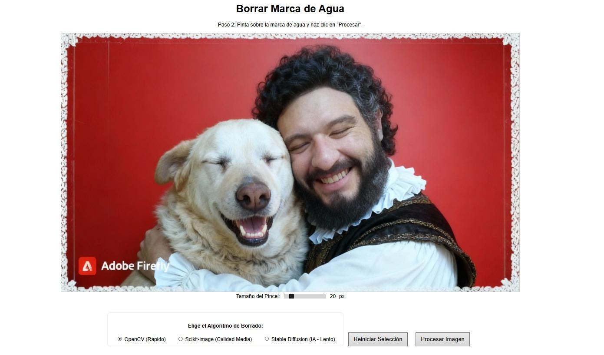
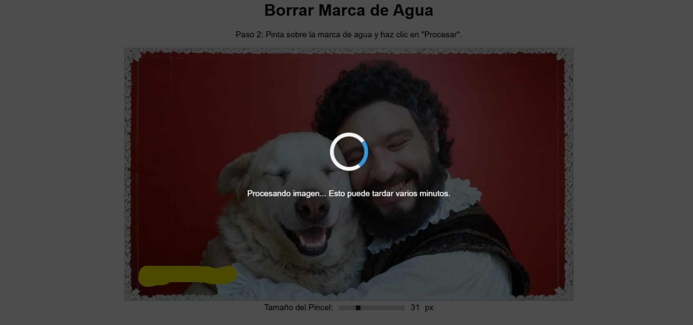
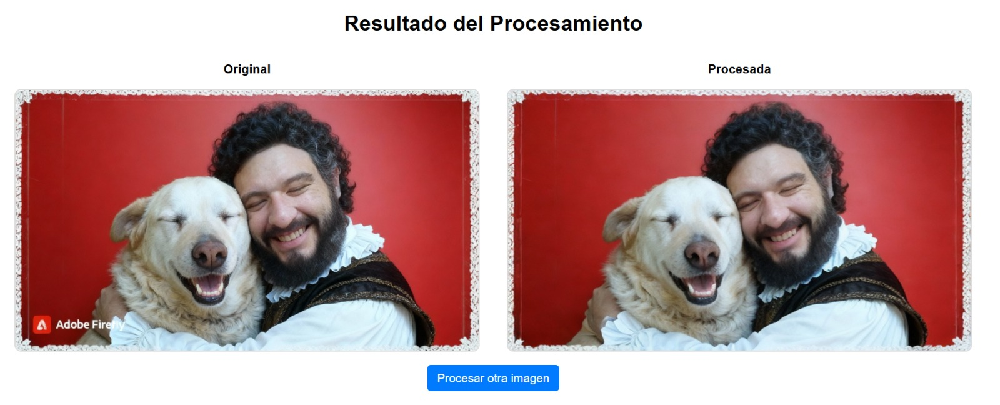
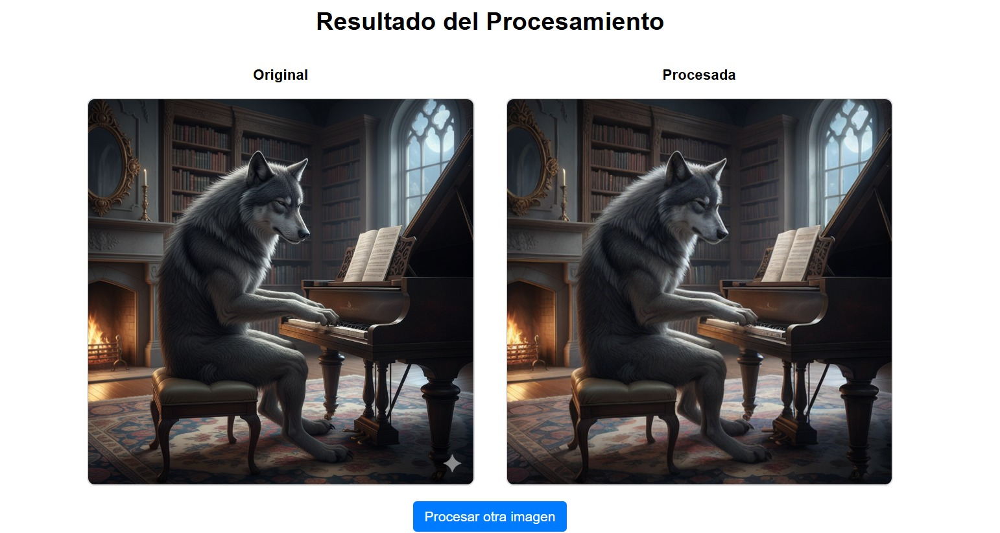

# Herramienta de Eliminación de Marcas de Agua

Esta es una aplicación web construida con Flask que permite a los usuarios subir una imagen, pintar sobre una marca de agua y eliminarla utilizando diferentes algoritmos de *inpainting*, incluyendo un modelo avanzado de Inteligencia Artificial (Stable Diffusion).

## Características

-   **Carga de Imágenes:** Sube tus imágenes en formato JPG, PNG, etc.
-   **Selección Interactiva:** Pinta directamente sobre la marca de agua que deseas eliminar.
-   **Pincel Ajustable:** Cambia el tamaño del pincel para una selección más precisa.
-   **Múltiples Algoritmos:** Elige entre tres métodos de borrado con diferente balance de velocidad y calidad:
    1.  **OpenCV (Rápido):** Ideal para fondos simples y resultados rápidos.
    2.  **Scikit-image (Calidad Media):** Mejor para reconstruir texturas.
    3.  **Stable Diffusion (IA - Lento, Alta Calidad):** Utiliza Inteligencia Artificial para reconstruir áreas complejas con un realismo asombroso.
-   **Interfaz Intuitiva:** Un flujo de trabajo guiado en varios pasos.
-   **Indicador de Carga:** Una pantalla de carga te informa mientras la imagen se está procesando, especialmente útil para los algoritmos más lentos.

## Tecnologías Utilizadas

-   **Backend:**
    -   [Flask](https://flask.palletsprojects.com/): Microframework web para Python.
    -   [OpenCV](https://opencv.org/): Biblioteca de visión por computadora para el inpainting básico.
    -   [Scikit-image](https://scikit-image.org/): Para el algoritmo de inpainting biharmonic.
    -   [PyTorch](https://pytorch.org/): Framework de Deep Learning.
    -   [Hugging Face Diffusers](https://huggingface.co/docs/diffusers/index): Para implementar el inpainting con Stable Diffusion.
-   **Frontend:**
    -   HTML5
    -   CSS3
    -   JavaScript (para la interactividad del canvas)

## Instalación
Sigue estos pasos para configurar el entorno de desarrollo en tu máquina local.

1.  **Prepara el proyecto:**
    Asegúrate de tener todos los archivos (`app.py`, la carpeta `templates`, etc.) en una misma carpeta.

3.  **Abre una terminal:**
    Abre PowerShell o el Símbolo del sistema en Windows y navega a la carpeta del proyecto. Si tu ruta tiene espacios, no olvides las comillas.
    ```bash
    cd "C:\Ruta\A\Tu\Proyecto"
    ```

4.  **Crea y activa un entorno virtual:**
    Es una buena práctica para aislar las dependencias. Ejecuta los siguientes comandos:
    ```bash
    # Crear el entorno
    python -m venv venv
    # Activar el entorno (en Windows)
    .\venv\Scripts\activate
    ```
    Una vez activado, verás `(venv)` al principio de la línea de comandos.

5.  **Crea el archivo `requirements.txt`:**
    Dentro de la carpeta de tu proyecto, crea un archivo `requirements.txt` y pega el siguiente contenido. Este archivo le dice a Python qué bibliotecas necesita tu proyecto.
    ```
    flask
    opencv-python
    numpy
    Pillow
    scikit-image
    torch
    diffusers
    transformers
    accelerate
    ```

6.  **Instala las dependencias:**
    Con el entorno virtual activado, ejecuta el siguiente comando. `pip` leerá el archivo `requirements.txt` e instalará todas las bibliotecas. Este paso puede tardar bastante tiempo.
    ```bash
    pip install -r requirements.txt
    ```

## Ejecución (Guía Visual)

Sigue estos pasos visuales para correr la aplicación después de la instalación.

1.  **Abre una terminal en la carpeta del proyecto.**
    Puedes hacer clic derecho en la carpeta y seleccionar una opción como "Abrir en Terminal" o "Abrir ventana de PowerShell aquí".

    

2.  **Activa el entorno virtual.**
    En la terminal que acabas de abrir, ejecuta el comando para activar el entorno que creaste durante la instalación.
    ```bash
    .\venv\Scripts\activate
    ```
    

3.  **Ejecuta la aplicación.**
    Con el entorno activado (verás `(venv)`), inicia el servidor de Flask.
    ```bash
    python app.py
    ```
    

4.  **Espera la carga del modelo (solo la primera vez):**
    La primera vez que ejecutes el servidor, el programa comenzará a descargar el modelo de Stable Diffusion.
    -   **Esto puede tardar varios minutos** y descargará varios Gigabytes.
    -   Verás mensajes de progreso en la terminal. ¡Ten paciencia!
    -   Este modelo se guarda en una carpeta de caché central de tu PC (`C:\Users\TuUsuario\.cache\huggingface`), por lo que **no se volverá a descargar** en futuras ejecuciones.

5.  **Accede a la aplicación:**
    Una vez que veas el mensaje `* Running on http://127.0.0.1:5000`, abre tu navegador web y ve a esa dirección:
    http://127.0.0.1:5000

## Cómo Usar la Aplicación

1.  **Paso 1:** Haz clic en "Seleccionar archivo", elige una imagen de tu computadora y presiona "Subir Imagen".
2.  **Paso 2:** Serás redirigido a la página de edición.
    -   Usa el control deslizante para ajustar el **tamaño del pincel**.
    -   **Pinta** sobre el área de la imagen que quieres eliminar.
    -   Elige el **algoritmo de borrado** que prefieras.
3.  **Paso 3:** Haz clic en "Procesar Imagen".
4.  **Paso 4:** Aparecerá una pantalla de carga. Espera a que el servidor termine el trabajo.
5.  **Paso 5:** ¡Listo! Verás la imagen original y la procesada. Puedes hacer clic en "Procesar otra imagen" para volver a empezar.

## Notas Importantes

-   **Rendimiento:** El algoritmo de **Stable Diffusion es extremadamente lento** en un CPU normal (puede tardar más de 5-10 minutos por imagen). Funciona mucho más rápido si tienes una tarjeta gráfica NVIDIA (GPU).
-   **Consumo de Memoria:** Los modelos de IA consumen una cantidad significativa de memoria RAM.

## Galería de Ejemplos Visuales

Aquí puedes ver el flujo de trabajo y los resultados en imágenes.

1.  **Paso 1: Selección del área a borrar**
    Se pinta sobre la marca de agua que se desea eliminar.
    

2.  **Paso 2: Procesamiento**
    La aplicación muestra una pantalla de carga mientras reconstruye la imagen.
    

3.  **Paso 3: Resultado Final**
    La imagen final sin la marca de agua.
    

4.  **Otro Ejemplo de Resultado**
    